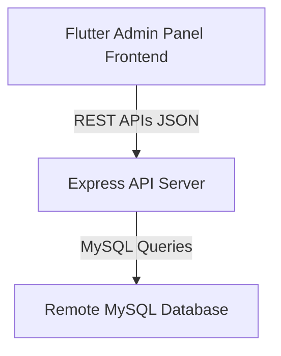

# Home Faciliti Admin Panel API Documentation

This document describes the design, setup, and routes of the backend API for the Home Faciliti Admin Panel.

---

## 1. System Architecture

The application is split into two primary layers:
1. **Frontend**: A Flutter-based desktop/web/mobile app that interacts with the backend via REST endpoints.
2. **Backend**: A Node.js Express server connected to the remote MySQL database hosted on BigRock.



---

## 2. Database Configuration

The backend connects to the MySQL server with the following credentials:
- **Host**: `homefaciliti.com` (BigRock host)
- **Database Name**: `homef4fw_homefaci`
- **Username**: `homef4fw_homefaci`
- **Port**: `3306`

### Schema Setup
To initialize the database tables, import the SQL commands defined in the [schema.sql](file:///d:/admin_panel/backend/schema.sql) file into your database.

---

## 3. API Setup & Local Running

1. **Navigate to backend folder**:
   ```bash
   cd d:/admin_panel/backend
   ```
2. **Install Node.js dependencies**:
   ```bash
   npm install
   ```
3. **Start the API server**:
   - For production:
     ```bash
     npm start
     ```
   - For development (with auto-reload):
     ```bash
     npm run dev
     ```

By default, the server runs on port `3000`. You can change this by modifying the `PORT` key inside the `backend/.env` file.

---

## 4. REST Endpoints Overview

All routes are prefixed with `/api`.

### Dashboard Stats
- `GET /api/dashboard` -> Returns high-level statistics (totals for users, categories, partners, earnings, etc.).

### Users
- `GET /api/users` -> Lists all registered users.
- `POST /api/users` -> Adds a new user. Body: `{ name, email, mobile, address }`
- `DELETE /api/users/:id` -> Deletes a user by ID.

### Categories
- `GET /api/categories` -> Lists all categories (with parent relation).
- `POST /api/categories` -> Adds a category. Body: `{ title, parent, image, status }`
- `PUT /api/categories/:id` -> Updates category details or toggles status.
- `DELETE /api/categories/:id` -> Deletes a category.

### Services
- `GET /api/services` -> Lists services and their pricing.
- `POST /api/services` -> Adds a service. Body: `{ title, price, image, description, status }`
- `PUT /api/services/:id` -> Edits details or toggles active status.
- `DELETE /api/services/:id` -> Deletes a service.

### Orders
- `GET /api/orders` -> Lists all orders.
- `POST /api/orders` -> Places a service order.
- `PUT /api/orders/:id` -> Updates order status (`Pending`, `Assigned`, `Completed`, `Cancelled`) or vendor assignment.
- `DELETE /api/orders/:id` -> Deletes an order.

### Partners (Vendors)
- `GET /api/partners` -> Lists all service providers, KYC status, and ratings.
- `POST /api/partners` -> Registers a new partner.
- `PUT /api/partners/:id` -> Approves KYC, updates earnings/wallet, or edits services list.
- `DELETE /api/partners/:id` -> Removes a partner.

### Earnings
- `GET /api/earnings/bookings` -> Lists payment records for bookings.
- `POST /api/earnings/bookings` -> Logs booking earnings.
- `GET /api/earnings/subscriptions` -> Lists vendor subscription histories.
- `POST /api/earnings/subscriptions` -> Logs subscription purchases.

### Dynamic Pages
- `GET /api/pages` -> Lists site pages (e.g. About Us, Terms).
- `POST /api/pages` -> Creates a page.
- `PUT /api/pages/:id` -> Updates page description text.
- `DELETE /api/pages/:id` -> Deletes page.

### Settings Configuration
- **Banners**: `GET|POST|PUT|DELETE /api/settings/banners`
- **States**: `GET|POST|PUT|DELETE /api/settings/states`
- **Cities**: `GET|POST|PUT|DELETE /api/settings/cities`
- **Localities**: `GET|POST|PUT|DELETE /api/settings/localities`
- **Reviews**: `GET|POST|PUT|DELETE /api/settings/reviews`
- **Notifications**: `GET|POST|PUT|DELETE /api/settings/notifications`
